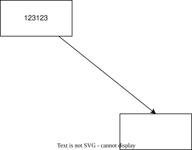

# Thiết lập C++ trên macOS

## 1. Cài đặt Clang

macOS sử dụng Clang làm trình biên dịch C/C++. Kiểm tra Clang đã được cài đặt bằng lệnh:

```bash
clang++ --version
```

Nếu chưa có, cài đặt Xcode Command Line Tools (bao gồm Clang):

```bash
xcode-select --install
```

Trong VS Code, cài extension **C/C++** của Microsoft. Khi chạy file C++ lần đầu, chọn **C/C++: clang++ build and debug active file**.

Xem hướng dẫn đầy đủ tại [Using Clang in Visual Studio Code](https://code.visualstudio.com/docs/cpp/config-clang-mac#_run-helloworldcpp).

## 2. Sửa cảnh báo C++11 trong Code Runner

Nếu gặp cảnh báo:

```text
warning: range-based for loop is a C++11 extension [-Wc++11-extensions]
```

với đoạn code như:

```cpp
for (const string& word : msg) {
    // ...
}
```

hãy cấu hình Code Runner biên dịch bằng chuẩn C++17:

1. Mở **Settings** trong VS Code.
2. Tìm `Code Runner: Executor Map`.
3. Chọn **Edit in settings.json**.
4. Tìm cấu hình `cpp` và thêm cờ `-std=c++17` ngay sau `g++`.

Trước khi sửa:

```json
"cpp": "cd $dir && g++ $fileName -o $fileNameWithoutExt && $dir$fileNameWithoutExt"
```

Sau khi sửa:

```json
"cpp": "cd $dir && g++ -std=c++17 $fileName -o $fileNameWithoutExt && $dir$fileNameWithoutExt"
```

Nếu muốn gọi trực tiếp Clang trên macOS, có thể dùng:

```json
"cpp": "cd $dir && clang++ -std=c++17 $fileName -o $fileNameWithoutExt && $dir$fileNameWithoutExt"
```

## Diagram


